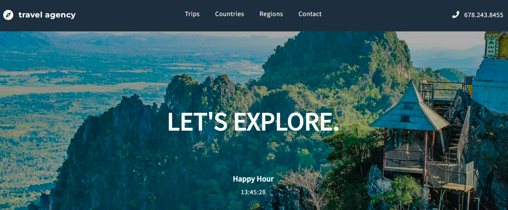

<p align="center">
</a>
</p>
<br>
  
# Travel agency - training of React Router and Redux skills

Travel agency website that offers tours with various options. The customer can search for tours by duration, name and tags. There are personalized tour options that anyone can add depending on their preferences. On the homepage there is a counter counting down to Happy Hour.

[:sparkles: Published version](https://marcela-os.github.io/travel-agency/)


## Tech Stack

* HTML
* CSS
* JavaScript JSX
* React
* Redux
* Router
* Webpack
* Jest/Enzyme
* GIT

  
## Lessons

* implementation of Router and Redux
* build React components composed of many subcomponents
* use different file structures in the React application
* create grid layout with react-flexbox-grid package
* how to use tests
* code testing
* write code in the TDD approach


## Room for Improvement

* develop functionality of the form 

  
## Run Locally

Install dependencies

```bash
  npm install
```

Start the server

```bash
  npm run start
```

  
## Authors

:woman: [@marcelaos](https://github.com/marcela-os)

  